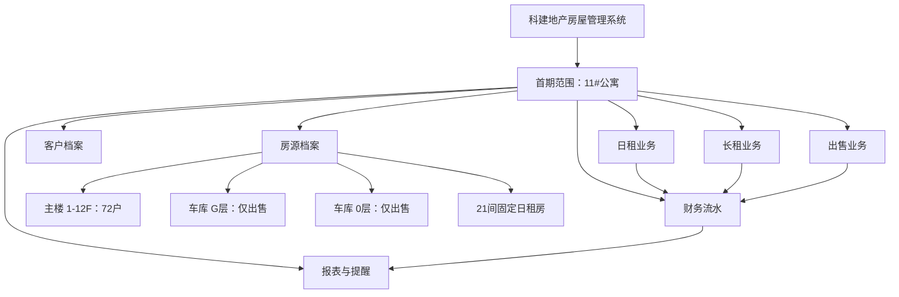
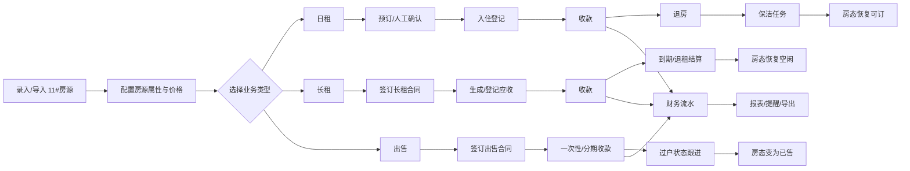
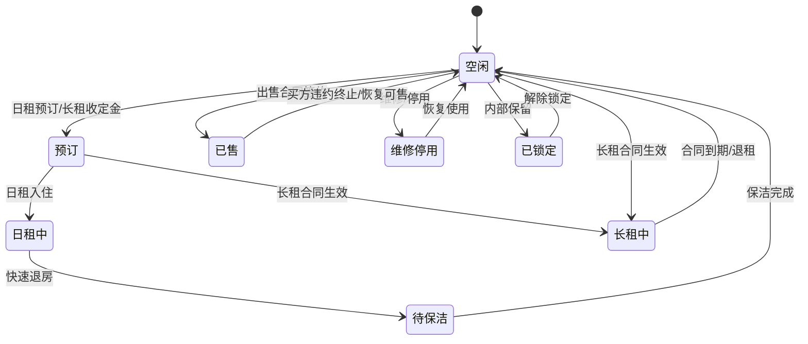
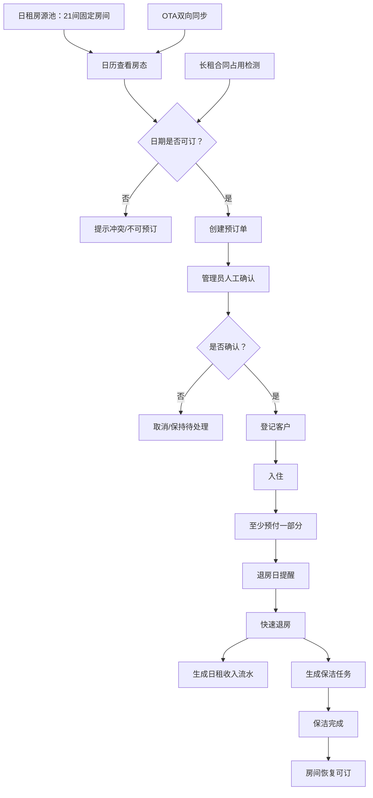
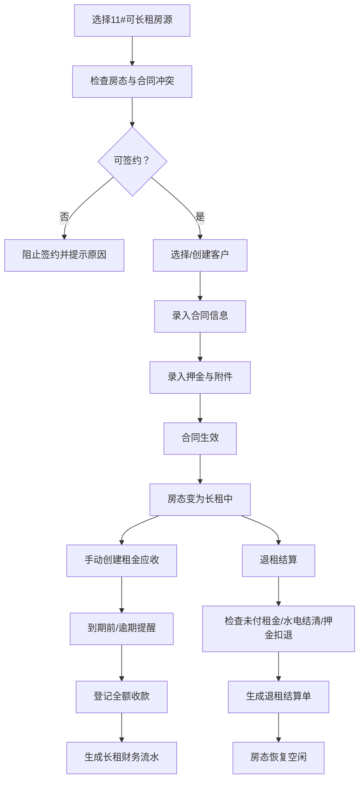
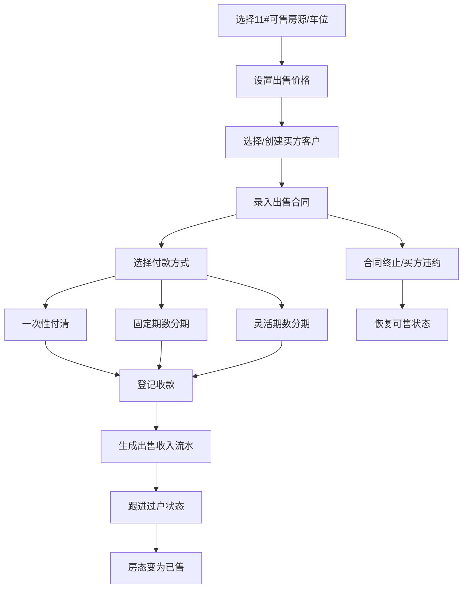
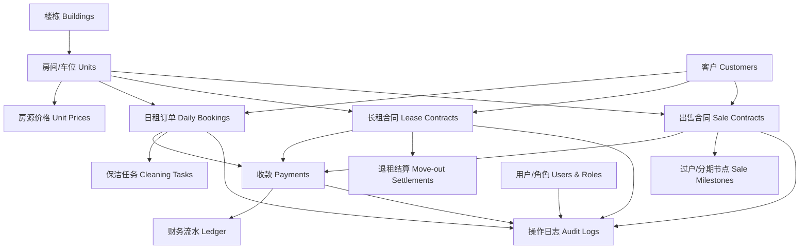
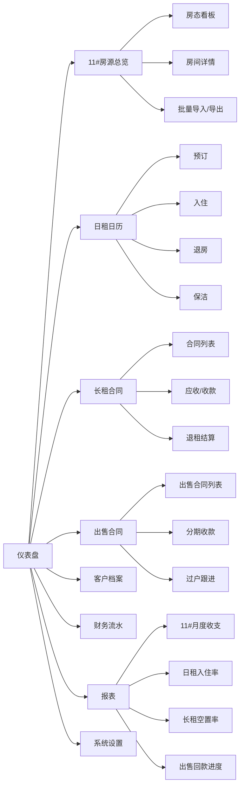

# 11#公寓首期业务流程框架图

> 范围：首期聚焦 `SASCI11 / 11#公寓`。主业务为日租、长租、出售，后续再扩展至 3#/4#/5#/6#/7# 等楼栋。

## 1. 首期业务边界

## 2. 总业务主流程

## 3. 11#房态流转

## 4. 日租业务流程（仅 11#固定21间）

## 5. 长租业务流程

## 6. 出售业务流程

## 7. 数据模块框架

## 8. 首期页面框架建议

## 9. 首期实现优先级

1. 基础档案：只初始化 11#公寓、72户主楼、G/0车库、21间日租房标记。
2. 客户档案：客户基础信息、黑名单、去重预留。
3. 房态中心：空闲、预订、日租中、待保洁、长租中、已售、维修/停用、已锁定。
4. 日租闭环：日历、预订、入住、预付、退房、保洁、收入流水。
5. 长租闭环：合同、应收、收款、退租结算、收入/押金流水。
6. 出售闭环：出售合同、一次性/分期收款、过户状态、已售/恢复可售。
7. 报表提醒：先做 11#维度，再为多楼栋扩展预留筛选字段。

