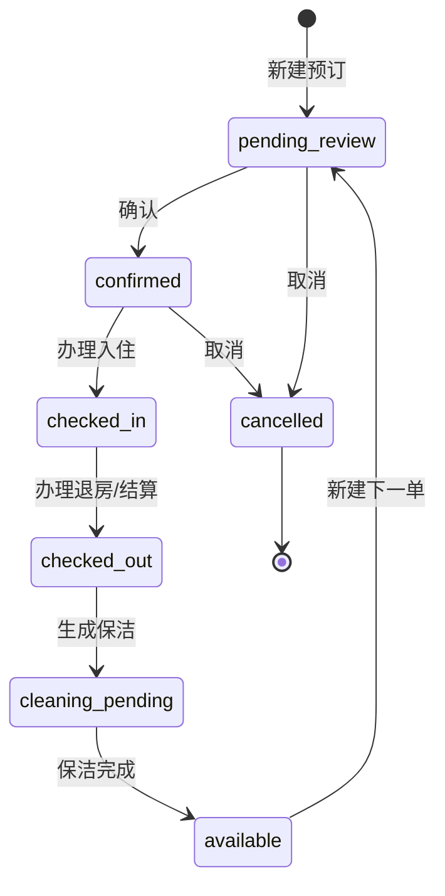

# 日租业务规则 v1

本文档用于统一 `/daily-rentals`、`/daily-rentals/overview`、经营驾驶舱、移动前台和财务流水中的日租判断逻辑。后续改代码时，先按这里的规则改，不再每个页面各算一套房态。

## 1. 核心原则

- `daily_bookings` 是日租事实源。日历、占用页、前台工作台、经营驾驶舱都应从同一套日租状态计算函数得到结果。
- `units.status` 只能作为当前状态缓存或人工锁定状态，不能单独决定一个日期是否可订。
- 普通“新建预订”只能创建今天及未来日期。历史入住记录必须走“历史补录”入口，并写审计日志。
- 同一房间同一晚只能有一个有效占用。但同一天“上午退房、保洁完成、下午入住”是允许的。
- 财务记录必须挂到对应 `booking_id`、`customer_id`、`unit_id`、`building_id`，日租收入、补款、结算和冲销要能追溯。

## 2. 日租订单状态机

## 3. 日期与冲突规则

### 3.1 普通新建预订

- `check_in < 今天`：禁止，返回 `pastDateNotAllowed`。
- 固定离店必须满足 `check_out > check_in`。
- 开放式未定离店允许没有 `check_out`。
- 黑名单客户禁止新建。
- 房间处于 `maintenance` 或 `locked` 时禁止新建。

### 3.2 历史补录

历史补录不是普通新建预订。它应该单独做入口，并满足：

- 仅管理员可用。
- 表单上明确显示“历史补录，不改变当前房态”。
- 可以选择过去日期。
- 创建后的订单默认应是 `checked_out` 或完整历史状态，而不是 `pending_review`。
- 必须写入 `audit_logs`，记录操作者、补录原因、补录日期范围。
- 不应把 `units.status` 改成 `reserved` 或 `daily_occupied`。

### 3.3 同日退房再入住

允许以下场景：

- A 单：`check_out = 2026-05-21`，早上退房。
- 系统生成保洁任务。
- 保洁完成后，B 单：`check_in = 2026-05-21`，下午入住。

冲突判断应按“夜晚占用”处理：

- 固定单占用区间为 `[check_in, check_out)`。
- 开放式在未实际退房前，占用区间为 `[check_in, +∞)`。
- 新单 `check_in = 上一单 check_out` 不算夜晚冲突。
- 但如果上一单当天还没退房，或退房后保洁未完成，新单只能创建为“待入住/等待保洁”，不能直接办理入住。

## 4. 页面显示规则

### 4.1 日租时间轴

- 默认显示“今天附近日期”，不要从每月 1 号开始。
- 每行房间高度要紧凑，确保 21 间日租房尽量一屏可读。
- 日期列应铺满可用宽度，避免右侧大面积留白。
- 空白格可点击新建预订；有条形订单的格子点击查看订单。
- 条形颜色要使用全局状态颜色，不使用孤立紫色方案。

建议状态色：

| 状态 | 视觉角色 |
| --- | --- |
| 可预订 | 绿色/青绿色，轻背景，清晰边框 |
| 预订 | 琥珀/暖黄，表示未来或待确认 |
| 入住/占用 | 橙色主色，最高可见度 |
| 待保洁 | 青色，和可预订区分 |
| 维修/锁定 | 红色 |

### 4.2 日租占用页

- 今日群发内容优先显示，不再用可滚动小框截断。
- 房态卡片按楼层分组显示，卡片中包含房号、客户、入住区间、应收/待收、状态。
- 有详细卡片后，下方重复表格可以删除。
- 日期如果只是查看当天群发内容，可以保留选择器；如果没有业务作用，应改成只读日期展示。

### 4.3 经营驾驶舱

- 老板优先看两类信息：财务状况、房间状态。
- 风险、数据健康应作为辅助区域，不抢主视觉。
- 房间状态、长租、出售、日租都必须使用同一套状态色逻辑。

## 5. 操作按钮规则

订单详情面板不要把所有按钮都堆出来。每个状态只给一个主操作：

| 当前状态 | 主操作 | 次操作 |
| --- | --- | --- |
| `pending_review` | 确认预订 | 取消 |
| `confirmed` | 办理入住 | 取消、打印 |
| `checked_in` | 办理退房 | 补款、优惠、打印 |
| `checked_out` | 查看结算 | 打印 |
| `cleaning_pending` | 完成保洁 | 查看退房单 |

## 6. 当前已落地的防护

- 普通 `createBooking` 已增加日期验证：过去日期返回 `pastDateNotAllowed`。
- 固定离店订单已校验 `check_out > check_in`。
- 历史补录尚未实现，应作为单独功能开发，不能复用普通新建预订。

## 7. 推荐实现顺序

1. 抽出统一的 `daily-rental-policy`：状态机、日期覆盖、冲突判断、可执行动作。
2. 让 `createBooking`、`checkIn`、`checkOut`、`completeCleaning` 全部调用 policy。
3. 让 `/daily-rentals`、`/daily-rentals/overview`、`/management`、移动前台使用同一个 `buildDailyRoomStateMap`。
4. 新增“历史补录”入口，仅管理员可用。
5. 重构 BookingPanel：按状态显示主操作，减少按钮堆叠。
6. 最后做 UI：时间轴铺满页面、紧凑行高、统一状态色。
